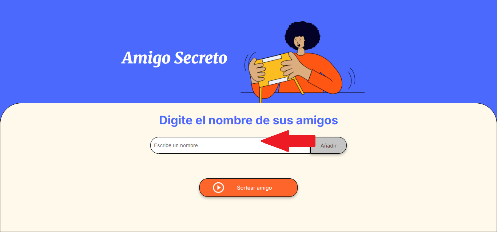
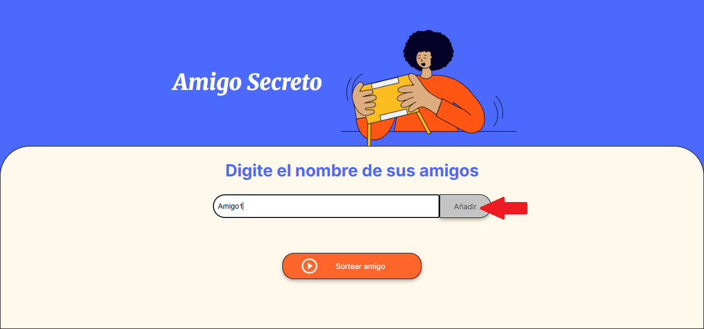
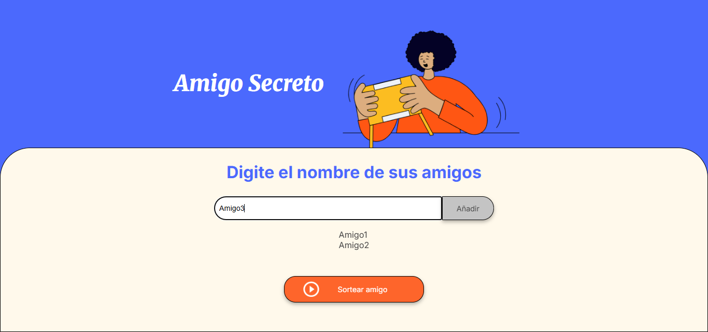
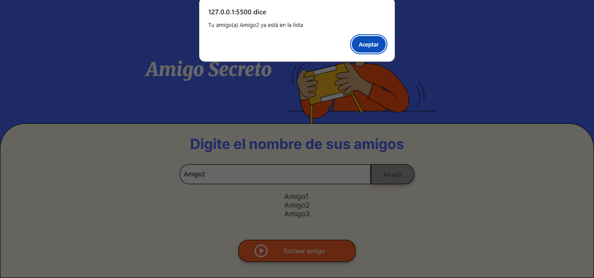
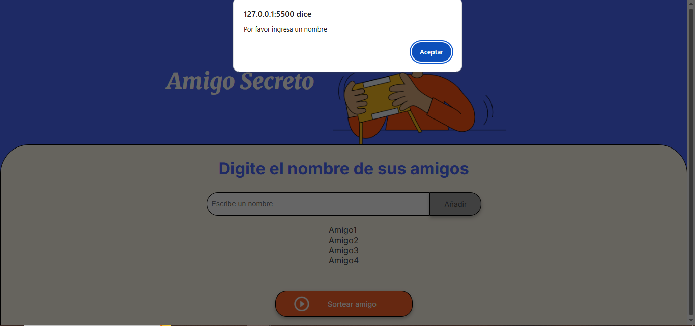
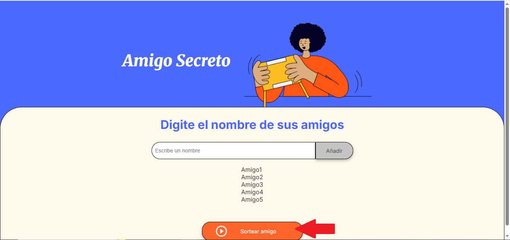
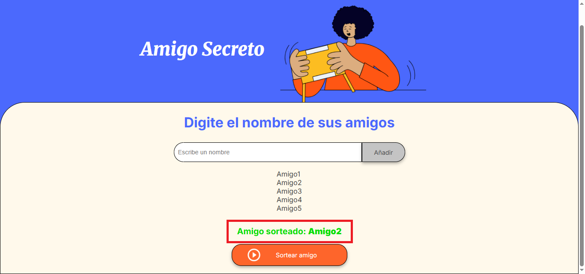

<h1>CHALLENGE AMIGO SECRETO</h1>

Este desafío permite al usuario agregar los nombres de sus amigos en una lista y realizar un sorteo para determinar quien es el amigo secreto. 

## Para jugar solo debes seguir los siguientes pasos:
- Ingresa el nombre de tu amigo

- Da click en **Añadir**

- ¡Puedes agregar tantos amigos como quieras!

- No puedes agregar a un amigo más de una vez

- Ni dejar el campo vacío

- Una vez agregados todos tus amigos da click en **sortear amigo**

- ¡Y listo! Descubre quién es el **amigo secreto**

